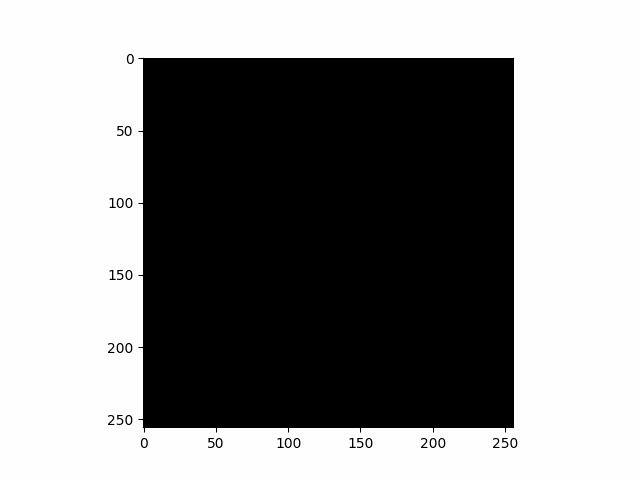

# NumPyDraw
Draw 2D and 3D shapes into NumPy array

### Example


### Usage
* import
```
import npd2d
import npd3d
```
* draw
```
npd2d.ellipse(array, fill, center, radius, rotation)
npd3d.spheroid(array, fill, center, radius, rotations):
```
